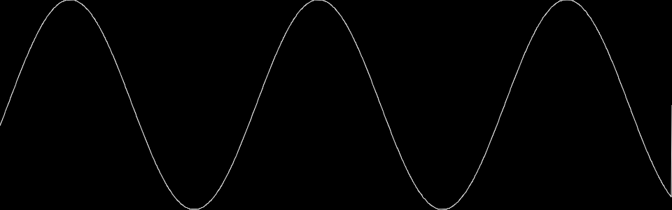

# crossaudio oscilloscope

This allows you to draw a spectrograph to a canvas.



## usage

Install in your web-project with `npm i @crossaudio/oscilloscope`. Use it in a synth, like this:

Put this in your HTML:

```html
<canvas id="canvas" width="960" height="300" style="background: black" /><br />
<label><span>frequency:</span> <input type="range" min="0" max="127" id="frequency"></label>
```

And this in your script:

```js
const mtof = note => 440 * Math.pow(2, (note - 69) / 12)

const synth = (context, params) => {
  // In this example, `white` is foreground, and `black` is background.
  const oscilloscope = new Oscilloscope(context, document.getElementById('canvas'), 'white', 'black')
  oscilloscope.start()

  const vco = context.createOscillator()
  vco.frequency.value = mtof(params.frequency)
  vco.start()

  params.on('frequency', value => {
    vco.frequency.value = mtof(value)
  })

  vco.connect(oscilloscope)
  oscilloscope.connect(context.destination)
}

// play synth
const params = new Params({
  frequency: 48
})
play(synth, params)

// hook up the UI
const freq = document.getElementById('frequency')
freq.onchange = e => { params.frequency = freq.value }
```

## TODO

- You might also be able to use it in [node-canvas](https://github.com/Automattic/node-canvas), test, and if it works, add an example